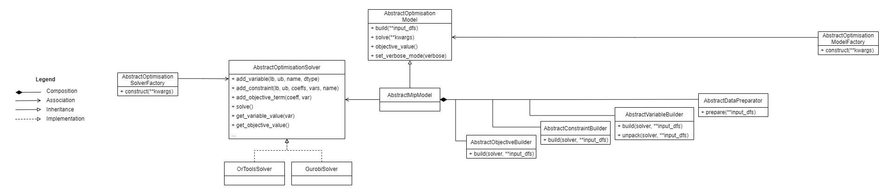

# Generic MIP framework

## Purpose
The aim of this repository is to...
* Unify the way MIP models are implemented in ECCO Sneaks & Data.
* Make models modular and highly customizable.
* Separate responsibilities by forcing the MIP implementations to separate constraints, objectives and variables.
* Separate responsibilities by removing settings logic from the model and let the model factory handle how to construct a model based on given settings.
* Abstract the solver layer to allow for fast switching between solver engines such as Google OR Tools, Gurobi and SCIP.

## Class overview
The Generic MIP framework is a collection of classes that can be used to construct a MIP model.
The classes are:
* [``AbstractOptimisationModel``](./generic_mip/abstract_model.py) - Represents an optimization problem in the broadest sense.
* [`AbstractMipModel`](./generic_mip/abstract_mip.py) - Represents a MIP model which is a specialization of the `AbstractOptimisationModel`.
* [`AbstractOptimizationSolver`](./generic_mip/abstract_solver.py) - Represents a MIP solver regardless of implementation.
  * [`OrToolsSolver`](./generic_mip/solver/ortools_solver.py) - Represents a MIP solver implemented with Google OR Tools.
  * [`GurobiSolver`](./generic_mip/solver/gurobi_solver.py) - Represents a MIP solver implemented with Gurobi.
* [`AbstractDataPreparator`](./generic_mip/abstract_data_prep.py) - A class used to prepare data for the model - this is used by the `AbstractMipModel`.
* [`AbstractVariableBuilder`](./generic_mip/abstract_var_builder.py) - A class used to construct decision variables - this is used by the `AbstractMipModel`.
* [`AbstractConstraintBuilder`](./generic_mip/abstract_constr_builder.py) - A class used to construct constraints - this is used by the `AbstractMipModel`.
* [`AbstractObjectiveBuilder`](./generic_mip/abstract_obj_builder.py) - A class used to construct objective terms - this is used by the `AbstractMipModel`.
* [`AbstractOptimizationModelFactory`](./generic_mip/abstract_model_factory.py) - A class used to construct a model and injects the necessary builders based on given context or settings.
* [`AbstractOptimisationSolverFactory`](./generic_mip/abstract_solver_factory.py) - A class used to construct a solver based on given context or settings.
* [`VariableDataType`](./generic_mip/variable_data_type.py) - An enum used to represent the data type of a decision variable.

Above classes is visualised ín the below UML class diagram. For an explanation of UML diagrams, please go to [https://www.uml-diagrams.org](https://www.uml-diagrams.org).



## Usage
To implement a MIP model, you need to create implementations of all the above abstract classes with two exceptions:
* The `AbstractSolver` already comes with two implementations.
* The `AbstractOptimisationModel` has a specialization, `AbstractMipModel`, which is the main class you need to implement.

All settings logics needs to be implemented in the factories. I.e. logic related to "if this setting is turned on, add decision variables X and Y and add constraint Z." is placed in the `AbstractModelFactory`, and logic related to "if used solver is SCIP, construct OrToolsSolver" is placed in the `AbstractSolverFactory`.
Code related to the data preparation is implemented in the `AbstractDataPreparator`. All builders and models should be instantiated in a model factory - never outside (e.g. never in a main function).

Code related to the decision variable construction is implemented in the `AbstractVariableBuilder`. I.e. "this dataframe with 10 rows infers the creation of 10 decision variables". Similar principles goes for the constraint and objective builders.
The idea is that dissimilar variables/constraints/objective terms are built by different builders, e.g. if they are formulated over different sets or serve different purposes. In IAR, this is the case for sink capacity and stock availability constraints - they are related to different types of locations and built over two different location sets - the sink and source locations respectively. Similarly, the order quantity and excess demand variables are build by different variable builders.

Given that you have started your project called "Awesome Stuff", your code should expose an API that can be used in following way:
```python
solver = AwesomeStuffSolverFactory().construct(some_settings)
model = AwesomeStuffModelFactory(solver).construct(some_other_settings)
model.build(some_df=some_prepared_df, some_other_df=some_other_prepared_df)
result_df = model.solve()
```

Here is an example of how we used the framework to implement Intelligent Auto Replenishment:
```python
solver = AutoReplenishmentSolverFactory().construct(settings.solver, [])
model = AutoReplenishmentModelFactory(solver).construct(settings, col_def)
model.build(sku_route_df=sku_route_df, demand_df=demand_df, location_df=location_df, parameter_df=parameter_df )
result_df = model.solve()
```

Deciding which solver to use is done in `AutoReplenishmentSolverFactory` in the call to `construct()`. 
Deciding what model components (constraints, variables, objectives) to use and how to construct them is done in `AutoReplenishmentModelFactory` in the call to `construct()`.
Building the components and preparing the model is done by calling `build()` on the model.
Finally, the model is solved by calling `solve()` on the model and the results are returned.

### Suggested first steps
You can implement the above classes by following the below steps. However, you can use any approach you like. Let this serve as a help if you do not know where to start.

* Start by creating empty implementations of the builders (one of each to begin with), the data preparator and the mip model. You can add some print statements to the empty methods to see and understand when they are called.
* Instantiate the model and provide the solver, the builders and data preparator and build the model to it to see that all the code runs and look at the print statements in the console.
* Now that you can see the code runs, start by translating _some_ of the decision variables into the empty decision variable builder. For this you need to establish some dataframes that are passed to the model and the builders. For now, you can prepare the data outside the model, i.e. transform it to format you need. The decision variables need to be returned either as a new dataframe or as a column in an existing dataframe. The decision variables are created by calling the solver instance.
* Run the code again to see the variables are built correctly.
* Now translate _some_ constraints that use these decision variables into the empty constraint builder. The variables should be accessible in a dataframe. You can use the dataframes that were passed to the model and the builders to fetch the parameters you need. The constraints are created by calling the solver instance.
* Run the code again to see the constraints are built correctly.
* Now translate _some_ objective terms that use the decision variables into the empty objective builder. You can use the dataframes that were passed to the model and the builders to fetch the parameters you need. The objective terms are created by calling the solver instance.
* Run the code again to see the objective are built correctly and try to solve the model.
* Now you can start implementing the data preparation logic in the data preparator.
* After all above is done, you can start implementing the factories. Here you can start with a version that always returns the same instance. Later you can pass a settings object that decides how to construct the model and the solver.
* By now you can implement the rest of the decision variables, constraints and objectives in the model.
* Finally, you can polish the API of you model and return the results and print useful info to the caller. The optimisation solution for each variable can be obtained by calling the solver instance.