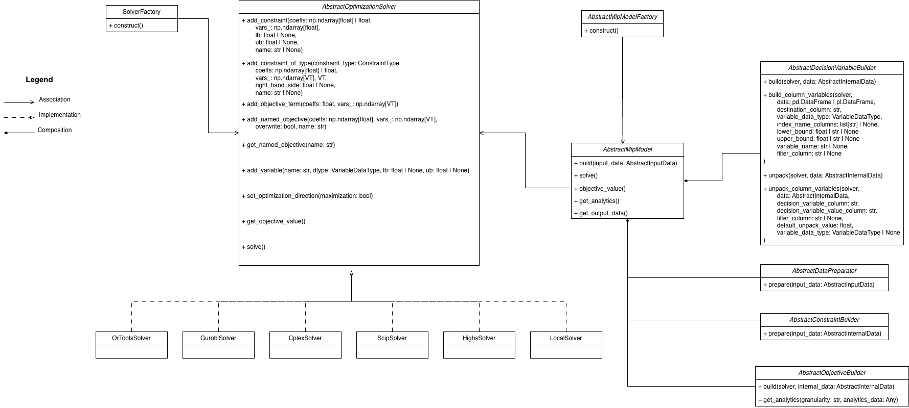

# Universal MIP

`umip` is both:
- a **MIP modeling package** with a unified solver API
- a **framework for structuring optimization systems** into explicit, reusable building blocks

The framework side is the core value: it enforces clean boundaries between data prep, variable creation, constraints, objectives, and model assembly. That structure makes large MIP codebases easier to grow, test, reason about, and explain.

## Purpose
The aim of this repository is to:
- Build complex MIP models through explicit, reusable building blocks.
- Make models modular, highly customizable, and easier to extend over time.
- Enforce separation of responsibilities by structuring implementations into dedicated builders for variables, constraints, and objective functions.
- Keep settings and composition logic in model factories, so model classes focus on optimization behavior.
- Use an object-oriented framework and factory interface to keep model assembly explicit and consistent.
- Treat objective analytics as a native framework capability, where each objective function builder can expose named analytics and/or granularity analytics.
- Abstract the solver layer to enable fast switching between solver engines such as OR-Tools, Gurobi, and SCIP.

## Poetry - transitioning to `uv` - to be updated
## Installation (Deprecated)
This project uses Poetry.

```bash
poetry install
```

Install optional solver extras as needed:

```bash
poetry install --extras ortools
poetry install --extras highs
poetry install --extras gurobi
poetry install --extras docplex
poetry install --extras pyscipopt
poetry install --extras localsolver
```

## Solver support
The framework supports multiple backends behind one API.

- OR-Tools engines (SCIP, CBC, CPLEX, XPRESS, GLPK, Gurobi)
- Native Gurobi
- Native CPLEX
- Native SCIP
- Native HiGHS

Select a backend via `SolverType` and create it through `SolverFactory`.
## Minimal usage flow
At a high level, production usage should look like this:

```python
model = MyModelFactory(logger=logger, solver_type=SolverType.ORTOOLS_SCIP).construct(
    settings=settings
)

model.build(input_data=input_data)
model.solve(time_limit=60.0)

output_data = model.get_output_data()
objective_value = model.get_objective_value()
product_analytics = model.get_analytics(granularity="product")
```

Notes:
- `build(...)` expects an `AbstractInputData` implementation.
- `solve(...)` runs the optimization and unpacks variable values through variable builders.
- `get_output_data()` delegates conversion via your model's `_convert_internal_to_output_data(...)`.

## Modelling variables and constraints in practice
The recommended approach for production models is to back decision variables with DataFrames (pandas or polars), where **each row represents one or more decision variable and associated parameters**. This keeps variables, their parameters, and their solved values co-located and makes vectorised operations natural.

### Creating variables
Use `build_column_variables` on `AbstractDecisionVariableBuilder` to add a column of solver variables to a DataFrame in one call. Bounds can be passed as a scalar or as a column name, in which case per-row values are read directly from the DataFrame:

```python
data.items = self.build_column_variables(
    solver=solver,
    data=data.items,
    destination_column=VAR,
    variable_domain=VariableDomain.INTEGER,
    index_name_columns=[ITEM_NAME],
    lower_bound=0.0,
    upper_bound=UPPER_BOUND,  # reads per-row values from the UPPER_BOUND column
)
```

### Unpacking solved values
Use `unpack_column_variables` after solving to replace the solver variable objects with their solved values in a new column:

```python
data.items = self.unpack_column_variables(
    data=data.items,
    decision_variable_column=VAR,
    decision_variable_value_column=VALUE,
    solver=solver,
    variable_domain=VariableDomain.INTEGER,
)
```

### Building constraints
Pass variable and coefficient columns directly as numpy arrays for vectorised constraint construction — one solver call per constraint regardless of the number of variables involved:

```python
solver.add_constraint(
    coefficients=np.ones(len(data.items)),
    variables=data.items[VAR].to_numpy(),
    upper_bound=100,
    name="flow",
)
```

See [`examples/settings_factory_example.py`](./examples/settings_factory_example.py) for a complete working example of this pattern.

## Multi-granularity analytics and white-boxing
One of the most useful framework features is native support for analytics at different granularities.

Typical pattern:
- implement objective analytics on highest granularity (for example, `product_store`)
- add a higher level (`store`)
- add an aggregate level (`total`)
- and optionally make these calculations nested/reused across levels with native caching at each level to avoid recalculation

This gives you a practical path to white-boxing complex models, as you can solve an optimization problem, while automatically get individual objective contributions on different granularities. This makes the model traceable and explainable at multiple business levels directly.

Relevant model APIs:
- `model.get_objective_analytics_granularities()`
- `model.get_analytics(granularity=...)`
- `model.get_named_objectives()`

## Framework-first project structure
When implementing a model package on top of `generic-mip`, a common structure is:

- `data_prep/`: input normalization and derivations.
- `variables/`: one builder per set of variables.
- `constraints/`: one builder per set of constraints.
- `objectives/`: one builder per objective function + analytics definitions.
- `factories/`: factories that build the model based on the input settings enabled for the run.
- `model.py`: concrete `AbstractMipModel` implementation.

This style keeps optimization systems modular and easier to evolve as requirements change.

## Suggested implementation path
### For a new project (ground up)
1. Start with a minimal base model made of the set of variables, set of constraints, and set of objective functions that are always present.
2. Make sure this base model solves the minimum problem you care about. The base can be feasible and useful even without optional objective functions.
3. Test the base model thoroughly.
4. Define a settings object early, but leave it intentionally empty to make it explicit that no settings are implemented yet.
5. Keep the factory settings-aware from day one, even if the first version only builds the base model.

### For an existing project (incremental extension)
1. Add or extend a settings object and wire it in the model factory so composition is decided from input settings.

```python
from dataclasses import dataclass


@dataclass
class FlowProblemMip:
    edge_cost: bool = False
```

2. Map each setting to the collection of constraint builders, variable builders, and objective function builders associated with that setting.
3. Implement only the collection of constraint builders, variable builders, and objective function builders needed to implement the new setting / feature.
4. Test each new setting / feature in isolation.

## Examples
You can inspect the repository examples in [`examples/`](./examples), but treat them primarily as development references.

If you specifically want a minimal settings-driven factory composition example, see [`examples/settings_factory_example.py`](./examples/settings_factory_example.py)

## Class overview
The Generic MIP framework is a collection of classes that can be used to construct a MIP model.
The classes are:
* [`AbstractMipModel`](./generic_mip/abstract_mip.py) - Represents a MIP model.
* [`AbstractOptimizationSolver`](./generic_mip/abstract_solver.py) - Represents a MIP solver regardless of implementation.
  * [`OrToolsSolver`](./generic_mip/solver/or_tools/_solver.py) - Represents a MIP solver implemented with Google OR Tools.
  * [`GurobiSolver`](./generic_mip/solver/gurobi/_solver.py) - Represents a MIP solver implemented with Gurobi.
  * [`CplexSolver`](./generic_mip/solver/cplex/_solver.py) - Represents a MIP solver implemented with CPLEX.
  * [`ScipSolver`](./generic_mip/solver/scip/_solver.py) - Represents a MIP solver implemented with SCIP.
  * [`HighsSolver`](./generic_mip/solver/highs/_solver.py) - Represents a MIP solver implemented with HiGHS.
  * [`LocalSolver`](./generic_mip/solver/local_solver/_solver.py) - Represents a MIP solver implemented with LocalSolver.
* [`AbstractDataPreparator`](./generic_mip/abstract_data_prep.py) - A class used to prepare data for the model - this is used by the `AbstractMipModel`.
* [`AbstractDecisionVariableBuilder`](./generic_mip/abstract_var_builder.py) - A class used to construct decision variables - this is used by the `AbstractMipModel`.
* [`AbstractConstraintBuilder`](./generic_mip/abstract_constr_builder.py) - A class used to construct constraints - this is used by the `AbstractMipModel`.
* [`AbstractObjectiveBuilder`](./generic_mip/abstract_obj_builder.py) - A class used to construct objective function terms - this is used by the `AbstractMipModel`.
* [`AbstractMipModelFactory`](./generic_mip/abstract_model_factory.py) - A class used to construct a model and injects the necessary builders based on given context or settings.
* [`SolverFactory`](./generic_mip/solver_factory/solver_factory.py) - A class used to construct a solver based on given context or settings.
* [`VariableWithObjectiveCoefficient`](./generic_mip/variable_with_objective_coefficient.py) - A class containing a decision variable and its objective coefficient.

Abstract data classes:
* [`AbstractInputData`](generic_mip/abstract_dataclasses.py) - A class containing input data.
* [`AbstractInternalData`](generic_mip/abstract_dataclasses.py) - A class containing internal data.
* [`AbstractOutputData`](generic_mip/abstract_dataclasses.py) - A class containing output data.

Enums:
* [`VariableDataType`](generic_mip/enums/variable_domain.py) - An enum used to represent the data type of a decision variable.
* [`SolverType`](generic_mip/enums/solver_type.py) - An enum of solver types.
* [`BoundType`](generic_mip/enums/bound_type.py) - An enum of bound types (lower/upper)
* [`ConstraintType`](generic_mip/enums/constraint_type.py) - An enum of constraint types.
* [`DataFrameArgumentType`](generic_mip/enums/data_types.py) - An enum of dataframe argument types.
* [`BoundArgumentType`](generic_mip/enums/data_types.py) - An enum of bound argument types.
* [`FilterColumnArgumentType`](generic_mip/enums/data_types.py) - An enum of filter column argument types.
* [`IndexColumnsArgumentType`](generic_mip/enums/data_types.py) - An enum of index column argument types.

Above classes is visualised ín the below UML class diagram. For an explanation of UML diagrams, please go to [https://www.uml-diagrams.org](https://www.uml-diagrams.org).


